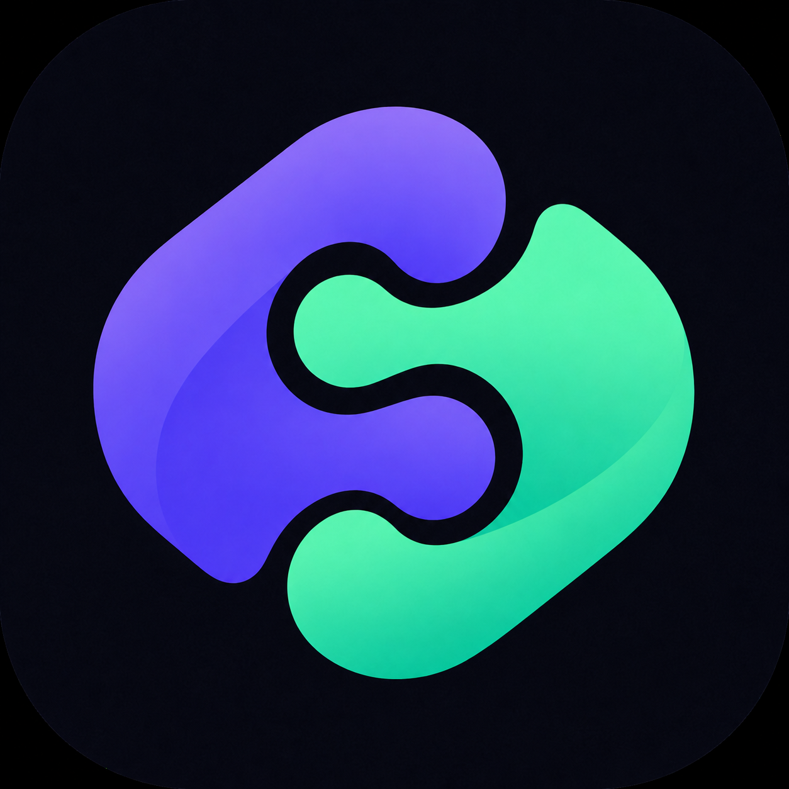
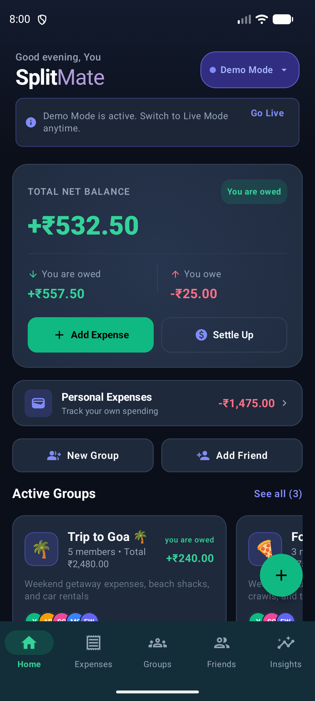
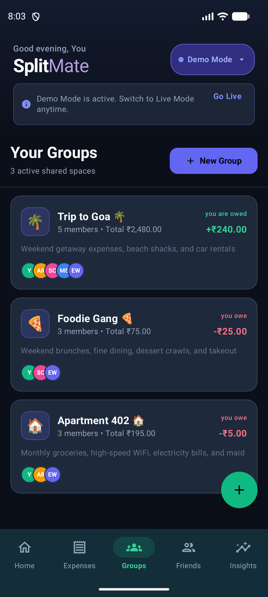
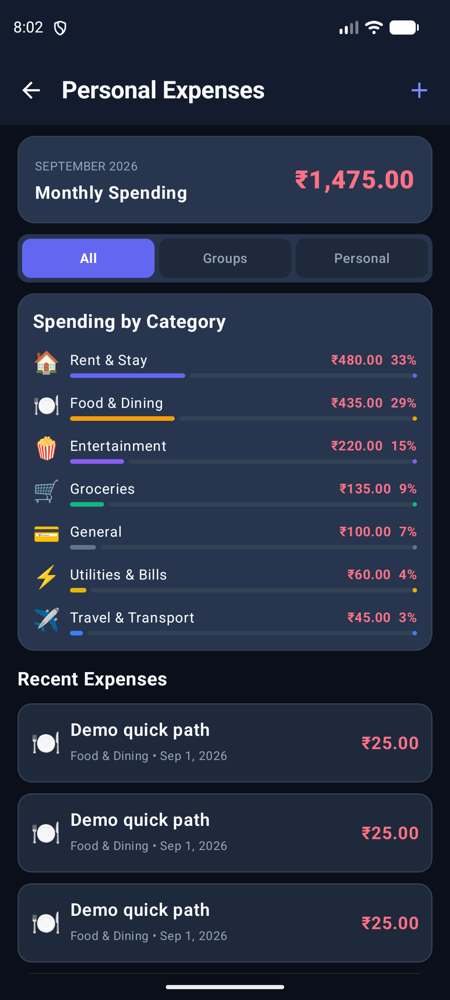

<p align="center">
  
</p>

<h1 align="center">SplitMate</h1>

<p align="center">
  <a href="https://github.com/Sagar-kesarkar/SplitMate/releases"></a>
  <a href="https://github.com/Sagar-kesarkar/SplitMate/actions/workflows/android-ci.yml"></a>
  
</p>

SplitMate is an offline-first Android expense-sharing application for friends, roommates and travel groups. It allows users to record shared and personal expenses, split bills, calculate group balances and understand who owes whom. SplitMate is currently in beta and remains under active development.

> **Development Status:** SplitMate is currently a beta application under active development. Features, data structures and interface elements may change. Users should not rely on it as their only financial record and should keep backups of important information.

## Download the beta

Download **SplitMate Beta V0** from [GitHub Releases](https://github.com/Sagar-kesarkar/SplitMate/releases). The direct APK link will be:

[`SplitMate-beta-V0.apk`](https://github.com/Sagar-kesarkar/SplitMate/releases/download/v0.1.0-beta.1/SplitMate-beta-V0.apk)

The V0 APK is an internal beta signed with an Android debug certificate. Future update APKs must use the same application ID and signing certificate, or Android will reject an in-place update.

### Install

1. Download `SplitMate-beta-V0.apk` on an Android 8.0 or newer device.
2. Open it from the browser or file manager.
3. Allow that app to install unknown apps if Android asks.
4. Select **Install**.

The GitHub Release also includes a `.sha256` file for integrity verification.

## Screenshots

These screenshots were captured on 2026-09-01 from the verified, already-installed V0 APK on a Pixel 6a emulator. They show persisted Demo data; totals can differ after adding or removing records.

<p align="center">
  
  
  
</p>

## Current features

- Separate Demo and Live Room databases with reactive `Flow`/`StateFlow` updates
- Group creation, editing, member management and contacts-assisted friend entry
- Shared expenses with equal, exact, percentage and share-based splits
- Pairwise signed balances, settlements, debt simplification and auditable balance history
- Group budgets with spent, remaining and over-budget states
- Personal expenses with monthly totals, category breakdowns and All/Groups/Personal history filters
- Expense search, group details, friend details, insights and local group chat
- Long-press group selection, persistent mute state, ownership-aware leave/delete actions and timed Undo
- Local persistence across process restarts

See [Features](docs/FEATURES.md) for supported and incomplete behavior.

## Technology

- Kotlin 2.2.21 and Java 17
- Jetpack Compose with Material 3
- Room 2.7.0-alpha11, schema version 4
- Coroutines, `Flow`, `StateFlow` and DataStore Preferences
- Gradle 8.13 and Android Gradle Plugin 8.13.2
- Compile/target SDK 36; minimum SDK 26
- JUnit, Robolectric, Compose UI tests and Roborazzi

SplitMate currently has one active Gradle module: `:app`.

## Offline-first behavior and privacy

Core groups, members, expenses, settlements, budgets, chat messages and preferences are stored locally. Demo and Live data use different Room databases. The current application has no Firebase, cloud synchronization, authentication or production backend integration. Read [Privacy](docs/PRIVACY.md) before using beta builds.

## Build from source

Requirements:

- Android Studio with Android SDK 36
- JDK 17
- Git

macOS/Linux:

```bash
git clone https://github.com/Sagar-kesarkar/SplitMate.git
cd SplitMate
./gradlew assembleDebug
```

Windows PowerShell:

```powershell
git clone https://github.com/Sagar-kesarkar/SplitMate.git
cd SplitMate
.\gradlew.bat assembleDebug
```

`local.properties` is intentionally not committed. Android Studio normally creates it with the local Android SDK path. See [Building](docs/BUILDING.md) and [Troubleshooting](docs/TROUBLESHOOTING.md).

## Repository structure

```text
app/                  Native Android application and tests
docs/                 Architecture, behavior, privacy and build guides
gradle/               Version catalog and Gradle Wrapper support
.github/              Source-validation CI and contribution templates
build.gradle.kts      Root Gradle plugin configuration
settings.gradle.kts   Project and module declaration
```

Distribution APKs, local SDK paths, IDE state, signing material, generated outputs, `dist/`, `releases/` and `local-archive/` are intentionally excluded from source history.

## Known limitations and roadmap

- V0 is debug-signed and intended for testing, not store distribution.
- The requested GitHub release tag (`v0.1.0-beta.1`) differs from the immutable APK manifest version (`1.1.0-beta.1`, code 2).
- Notifications are not delivered by a local or remote notification service; mute state is persisted and displayed locally.
- Online reminders and multi-device synchronization are not available.
- Receipt-image attachment picking/OCR is not implemented; expense receipt notes are local text.
- Live mode starts empty and is populated by the user; Demo mode contains deterministic sample records.

Planned work includes release signing, export/backup tooling, accessibility coverage, notification delivery and optional synchronization designed around explicit consent.

## Contributing and security

Read [Contributing](CONTRIBUTING.md), the [Code of Conduct](CODE_OF_CONDUCT.md) and [Security Policy](SECURITY.md) before opening a change. Please never include personal financial data, database files, API keys or signing files in an issue or pull request.

## Licence

SplitMate is available under the [MIT License](LICENSE). You may use, copy, modify and redistribute the source subject to its terms.

## Releases

All beta downloads and release notes are published on the [SplitMate Releases page](https://github.com/Sagar-kesarkar/SplitMate/releases).
